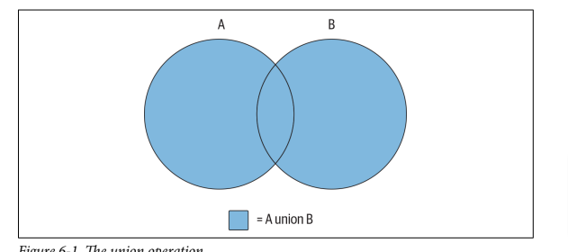
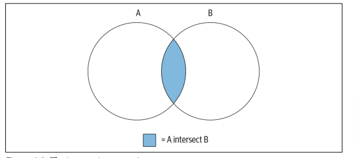

# SQL Cheat Sheet


#### BASICS

1. [Populating & Modifying Tables](https://github.com/jeznacki/SQL-Cheatsheet#populating-and-modifying-tables) - **CREATE, INSERT, UPDATE, WHERE, DISTINCT**
2. [Querying Multiple Tables](https://github.com/jeznacki/SQL-Cheatsheet#querying-multiple-tables) - **INNER JOIN, SELECT**
3. [Usnig Sets](https://github.com/jeznacki/SQL-Cheatsheet#usnig-sets-unionintersect) - **UNION ALL, INTERSECT**
4. [Temporary tables & Views](https://github.com/jeznacki/SQL-Cheatsheet#temporary-tables-and-views) - **VIEW, TEMPORARY TABLE**
5. [Data Manipulation & Conversion](https://github.com/jeznacki/SQL-Cheatsheet#data-manipulation--conversion-functions) - **LENGTH(), REPLACE(), POSITION(), CEIL(), FLOOR(), STR_TO_DATE()**
6. [Data Grouping and Aggregates](https://github.com/jeznacki/SQL-Cheatsheet#data-grouping-and-aggregates) - **GROUP BY, HAVING, MAX(), MIN(), COUNT(), SUM() AVG()**

#### ADVANCED
1. [Subqueries](https://github.com/jeznacki/SQL-Cheatsheet#subqueries) - **SELECT * FROM (SELECT * FROM other_table)**
2. [Joins](https://github.com/jeznacki/SQL-Cheatsheet#joins) - **OUTER JOIN, MULTIPLE TABLES, NATURAL JOIN**
3. [SQL Conditionals](https://github.com/jeznacki/SQL-Cheatsheet/blob/main/README.md#sql-conditionals) - **CASE, WHEN, THEN**
4. [Views](https://github.com/jeznacki/SQL-Cheatsheet/blob/main/README.md#views-1) - **VIEW**
<br/>


# Populating and Modifying Tables


### CREATE Table

```sql
CREATE TABLE users(
id INT AUTO_INCREMENT,
   first_name VARCHAR(100),
   last_name VARCHAR(100),
   email VARCHAR(50),
   password VARCHAR(20),
   location VARCHAR(100),
   dept VARCHAR(100),
   is_admin TINYINT(1),
   register_date DATETIME,
   PRIMARY KEY(id)
);

/* delete table */

DROP TABLE tablename;
```

### INSERT table Row

```sql

/* single row */

INSERT INTO users (first_name, last_name, email, password, location, dept, is_admin, register_date) values ('Brad', 'Traversy', 'brad@gmail.com', '123456','Massachusetts', 'development', 1, now());

/* multiple rows */

INSERT INTO users (first_name, last_name, email, password, location, dept,  is_admin, register_date) values ('Fred', 'Smith', 'fred@gmail.com', '123456', 'New York', 'design', 0, now()), ('Sara', 'Watson', 'sara@gmail.com', '123456', 'New York', 'design', 0, now()),('Will', 'Jackson', 'will@yahoo.com', '123456', 'Rhode Island', 'development', 1, now()),('Paula', 'Johnson', 'paula@yahoo.com', '123456', 'Massachusetts', 'sales', 0, now()),('Tom', 'Spears', 'tom@yahoo.com', '123456', 'Massachusetts', 'sales', 0, now());
```

### UPDATE and DELETE data
```sql

UPDATE person SET street = '1225 Tremont St.',city = 'Boston', state = 'MA', country = 'USA', postal_code = '02138' WHERE person_id = 1;

DELETE FROM person WHERE person_id = 2;
```


### SELECT Clause

```sql
SELECT language_id, name, last_update FROM language;
```
| language_id | name | last_update |
|-------------|----------|---------------------|
| 1 | English | 2006-02-15 05:02:19 |
| 2 | Italian | 2006-02-15 05:02:19 |


### WHERE Clause

```sql
SELECT * FROM users WHERE location='Massachusetts';
SELECT * FROM users WHERE location='Massachusetts' AND dept='sales';
SELECT * FROM users WHERE is_admin = 1;
SELECT * FROM users WHERE is_admin > 0;
SELECT * FROM film WHERE (rating = 'G' AND rental_duration >= 7) OR (rating = 'PG-13' AND rental_duration < 4);
SELECT * FROM rental WHERE rental_date BETWEEN '2005-06-14' AND '2005-06-16';
```

### DISTINCT - removing duplicates

```sql
SELECT DISTINCT actor_id FROM film_actor ORDER BY actor_id;
```

### Column Aliases
```sql

SELECT id,'COMMON' AS language_usage, language_id * 3.1415927 AS lang_pi_value, upper(name) AS language_name FROM language;

```
| id | language_usage | lang_pi_value | language_name |
|-------------|---------------|---------------|---------------|
| 1 | COMMON | 3.1415927 | ENGLISH |
| 2 | COMMON | 6.2831854 | ITALIAN |


### Using Subqueries

```sql
SELECT * FROM film WHERE rating IN (SELECT rating FROM film WHERE title LIKE '%PET%');
```

<br /><br />

# Querying Multiple Tables

### Cartesian Product

the Cartesian product, which is every permutation of the two tables. Each row gets joined all rows fromthe second table.

```sql
SELECT c.first_name, c.last_name, a.address FROM customer c JOIN address a;
```

### Inner Joins

This type of join is known as an inner join, and it is the most commonly used type of join. To clarify, if a row in the customer table has the value 999 in the
address_id column and there’s no row in the address table with a value of 999 in the address_id column, then that customer row would not be included in the result set.

```sql
SELECT c.first_name, c.last_name, a.address FROM customer c JOIN address a ON c.address_id = a.address_id;

/* If you do not specify the type of join, then the server will do an inner join by default. */

SELECT c.first_name, c.last_name, a.address FROM customer c INNER JOIN address a ON c.address_id = a.address_id;
```

### The ANSI Join Syntax
Another version of JOIN syntax
```sql
SELECT c.first_name, c.last_name, a.address FROM customer c, address a WHERE c.address_id = a.address_id;
```

### Joining Three or More Tables

```sql
SELECT *
FROM customer c
INNER JOIN address a
ON c.address_id = a.address_id
INNER JOIN city ct
ON a.city_id = ct.city_id;

/* order is not important  */

SELECT c.first_name, c.last_name, ct.city
FROM city ct
INNER JOIN address a
ON a.city_id = ct.city_id
INNER JOIN customer c
ON c.address_id = a.address_id;
```

### Using Subqueries as Tables
```sql

SELECT c.first_name, c.last_name, addr.address, addr.city
FROM customer c
INNER JOIN
(SELECT a.address_id, a.address, ct.city
  FROM address a
  INNER JOIN city ct
  ON a.city_id = ct.city_id
  WHERE a.district = 'California'
  ) addr
  ON c.address_id = addr.address_id;

```

### Self-Joins

You can actually join a table to itself. This might seem like a strange thing to do at first, but there are valid reasons for doing so. Some tables include a self-referencing foreign key, which means that it includes a column that points to the primary key within the same table.


```sql
SELECT f.title
 FROM film f
 INNER JOIN film f_prnt
 ON f_prnt.film_id = f.prequel_film_id
 WHERE f.prequel_film_id IS NOT NULL;
```

<br /><br />

# Usnig Sets (UNION,INTERSECT)
when performing set operations on two data sets, the following guidelines must apply:

• Both data sets must have the same number of columns.
• The data types of each column across the two data sets must be the same (or the server must be able to convert one to the other).


### UNION & UNION ALL
union sorts the combined set and removes duplicates, whereas union all does not.



```sql
SELECT 'CUST' typ, c.first_name, c.last_name
 FROM customer c
 UNION ALL
 SELECT 'ACTR' typ, a.first_name, a.last_name
 FROM actor a;
```


### Intersect Operator

If the two queries in a compound query return nonoverlapping data sets, then the
intersection will be an empty set.



```sql
SELECT c.first_name, c.last_name
FROM customer c
WHERE c.first_name LIKE 'D%' AND c.last_name LIKE 'T%'
INTERSECT
SELECT a.first_name, a.last_name
FROM actor a
WHERE a.first_name LIKE 'D%' AND a.last_name LIKE 'T%';
```


### The except Operator


```sql
SELECT a.first_name, a.last_name
FROM actor a
WHERE a.first_name LIKE 'J%' AND a.last_name LIKE 'D%'
EXCEPT
SELECT c.first_name, c.last_name
FROM customer c
WHERE c.first_name LIKE 'J%' AND c.last_name LIKE 'D%';
```

<br /><br />

# Temporary Tables and Views

### Temporary tables
These tables look just like permanent tables, but any data inserted into a temporary table will disappear at some point (generally at the
end of a transaction or when your database session is closed).

```sql

CREATE TEMPORARY TABLE actors_j (actor_id smallint(5), first_name varchar(45), last_name varchar(45));

INSERT INTO actors_j
-> SELECT actor_id, first_name, last_name
-> FROM actor
-> WHERE last_name LIKE 'J%';

```
These rows are held in memory temporarily and will disappear after your ses‐sion is closed.


### VIEWs
A view is a query that is stored in the data dictionary. It looks and acts like a table, but
there is no data associated with a view (this is why I call it a virtual table).

```sql
CREATE VIEW cust_vw AS SELECT customer_id, first_name, last_name, active FROM customer;
```

When the view is created, no additional data is generated or stored: the server simply
tucks away the select statement for future use. Now that the view exists, you can
issue queries against it, as in:

```sql
SELECT first_name, last_name FROM cust_vw WHERE active = 0;
```
<br/><br/>

# Data Manipulation & Conversion Functions

## Strings

#### LENGTH()
```sql
SELECT LENGTH(char_fld) char_length, LENGTH(vchar_fld) varchar_length, LENGTH(text_fld) text_length FROM string_tbl;
```
| char_length | varchar_length | text_length |
|-------------|----------------|-------------|
| 28 | 28 | 28 |


#### POSITION()

```sql
SELECT POSITION('characters' IN vchar_fld) FROM string_tbl;
```
| POSITION('characters' IN vchar_fld) |
|-------------------------------------|
| 19 |


#### INSERT() / REPLACE()

```sql
SELECT INSERT('goodbye world', 9, 0, 'cruel ') string;
```
| string |
|---------------------|
| goodbye cruel world |


## Numeric

#### MOD()

the modulo operator

```sql
SELECT MOD(10,4);
```

| MOD(10,4) |
|-----------|
| 2 |

#### CEIL() / FLOOR() / ROUND()

Controlling Number Precision

```sql
SELECT CEIL(72.445), FLOOR(72.445);
```

| CEIL(72.445) | FLOOR(72.445) |
|--------------|---------------|
| 73 | 72 |

```sql
SELECT CEIL(72.000000001), FLOOR(72.999999999);
```

| CEIL(72.000000001) | FLOOR(72.999999999) |
|--------------------|---------------------|
| 73 | 72 |

```sql
SELECT ROUND(72.49999), ROUND(72.5), ROUND(72.50001);
```

| ROUND(72.49999) | ROUND(72.5) | ROUND(72.50001) |
|-----------------|-------------|-----------------|
| 72 | 73 | 73 |


## Time/ Time Zones

### String-to-date conversions

#### CAST

```sql
SELECT CAST('2019-09-17 15:30:00' AS DATETIME);
```

| CAST('2019-09-17 15:30:00' AS DATETIME) |
|-----------------------------------------|
| 2019-09-17 15:30:00 |

If you need to generate temporal data from a string and the string is not in the proper form to use the **cast()** function, you can use a built-in function that allows you to
provide a format string along with the date string. **str_to_date()**

#### STR_TO_DATE

```sql
UPDATE rental  SET return_date = STR_TO_DATE('September 17, 2019', '%M %d, %Y') WHERE rental_id = 99999;
```

### Date manipulation

#### DATE_ADD

how to add five days to the current date:

```sql
SELECT DATE_ADD(CURRENT_DATE(), INTERVAL 5 DAY)
```

#### DAYNAME

to determine which day of the week a certain date falls on,

```sql
SELECT DAYNAME('2019-09-18');
```
| DAYNAME('2019-09-18') |
|-----------------------|
| Wednesday |

#### EXTRACT

example, if you want to extract just the year portion of a datetime value, you can do the following:

```sql
SELECT EXTRACT(YEAR FROM '2019-09-18 22:19:05');
```
| EXTRACT(YEAR FROM '2019-09-18 22:19:05') |
|------------------------------------------|
| 2019 |

#### DATE DIFFERENCE

```sql
SELECT DATEDIFF('2019-09-03', '2019-06-21');
```

| DATEDIFF('2019-09-03', '2019-06-21') |
|--------------------------------------|
| 74|

# Data Grouping and Aggregates

| customer_id |
|-------------|
| 1 |
| 1 |
...
| 599 |
| 599 |


### GROUP BY

You can ask the database server to group the data for you by using the group by clause. Here’s the same query but employing a group by clause to group the rental
data by customer ID:

```sql
SELECT customer_id FROM rental GROUP BY customer_id;
```

| customer_id |
|-------------|
| 1 |
| 2 |
...
| 598 |
| 599 |


To see how many films each customer rented, you can use an **aggregate** function

```sql
SELECT customer_id, count(*) FROM rental GROUP BY customer_id;
```

| customer_id | count(\*) |
|-------------|----------|
| 1 | 32 |
| 2 | 27 |


### GROUP BY + HAVING

You cannot refer to the aggregate function count(\*) in your **where** clause, you must put your group filter conditions in the having clause.

```sql
SELECT customer_id, count(*) FROM rental GROUP BY customer_id HAVING count(*) >= 40;
```

### Other aggregate Functions

**max()** Returns the maximum value within a set

**min()** Returns the minimum value within a set

**avg()** Returns the average value across a set

**sum()** Returns the sum of the values across a set

**count()** Returns the number of values in a set


All in one example

```sql
SELECT MAX(amount) max_amt, MIN(amount) min_amt,AVG(amount) avg_amt, SUM(amount) tot_amt, COUNT(*) num_payments FROM payment;
```

| max_amt | min_amt | avg_amt | tot_amt | num_payments |
|--------|--------|----------|---------|--------------|
| 11.99 | 0.00 | 4.200667 | 67416.51 | 16049 |

### Advanced examples

**Multicolumn Grouping**

```sql
SELECT fa.actor_id, f.rating, count(*)
 FROM film_actor fa
   INNER JOIN film f
   ON fa.film_id = f.film_id
 GROUP BY fa.actor_id, f.rating
 ORDER BY 1,2;
```

| actor_id | rating | count(\*) |
|----------|--------|----------|
| 1 | G | 4 |
| 1 | PG | 6 |
| 1 | PG-13 | 1 |
| 1 | R | 3 |
| 1 | NC-17 | 5 |
| 2 | G | 7

**Multicolumn Grouping with filtering**

```sql
SELECT fa.actor_id, f.rating, count(*)
  FROM film_actor fa
   INNER JOIN film f
   ON fa.film_id = f.film_id
 WHERE f.rating IN ('G','PG')
 GROUP BY fa.actor_id, f.rating
 HAVING count(*) > 9;
```

| actor_id | rating | count(\*) |
|----------|--------|----------|
| 137 | PG | 10 |
| 37 | PG | 12 |
| 180 | PG | 12 |
| 7 | G | 10 |
| 83 | G | 14 |
| 129 | G | 12 |
| 111 | PG | 15 |
| 44 | PG | 12 |
| 26 | PG | 11 |
| 92 | PG | 12 |

# Subqueries

### Simple example

```sql
SELECT customer_id, first_name, last_name
 FROM customer
 WHERE customer_id = (SELECT MAX(customer_id) FROM customer);
```

### Noncorrelated Subqueries

it may be exe‐cuted alone and does not reference anything from the containing statement.

```sql
SELECT city_id, city
 FROM city
 WHERE country_id = (SELECT country_id FROM country WHERE country = 'India');
 
SELECT city_id, city
 FROM city
 WHERE country_id NOT IN (SELECT country_id  FROM country  WHERE country IN ('Canada','Mexico'));
```


### Multicolumn Subqueries

you can use subqueries that return two or more columns.

```sql
SELECT fa.actor_id, fa.film_id
 FROM film_actor fa
 WHERE fa.actor_id IN
 (SELECT actor_id FROM actor WHERE last_name = 'MONROE')
 AND fa.film_id IN
 (SELECT film_id FROM film WHERE rating = 'PG');
```

### Correlated Subqueries

A correlated subquery is **dependent** on its containing statement from which it references **one or more columns.**

```sql
SELECT c.first_name, c.last_name
 FROM customer c
 WHERE 20 =
 (SELECT count(*) FROM rental r WHERE r.customer_id = c.customer_id); /* here it utilises c.customer.id */
```

## Subqueries as Data Sources

Since a subquery generates a result set containing rows and columns of data, it is perfectly valid to include subqueries in your from clause along with tables.

```sql
SELECT c.first_name, c.last_name,
 pymnt.num_rentals, pymnt.tot_payments
 FROM customer c
  INNER JOIN
   (SELECT customer_id, count(*) num_rentals, sum(amount) tot_payments
     FROM payment
     GROUP BY customer_id
   ) pymnt /* definded as a table */
   ON c.customer_id = pymnt.customer_id;
```

# JOINS

### OUTER JOIN

If you want the query to return all rows, regardless of whether or not there are rows in the other table, you can use an **outer join**, which essentially makes the join condition optional:

**INNER JOIN RESULT**

```sql
SELECT f.film_id, f.title, i.inventory_id
 FROM film f
 INNER JOIN inventory i
   ON f.film_id = i.film_id
  WHERE f.film_id BETWEEN 13 AND 15;
```
only results matching condition

| film_id | title | inventory_id |
|---------|--------------|-------------|
| 13 | ALI FOREVER | 67 |
| 13 | ALI FOREVER | 68 |
| 13 | ALI FOREVER | 69 |
| 13 | ALI FOREVER | 70 |
| 15 | ALIEN CENTER | 71 |
| 15 | ALIEN CENTER | 72 |


**OUTER JOIN RESULT**

```sql
SELECT f.film_id, f.title, i.inventory_id
   FROM film f
   LEFT OUTER JOIN inventory i
    ON f.film_id = i.film_id
   WHERE f.film_id BETWEEN 13 AND 15;
```

all results matching condition


| film_id | title | inventory_id |
|---------|----------------|--------------|
| 13 | ALI FOREVER | 67 |
| 13 | ALI FOREVER | 68 |
| 13 | ALI FOREVER | 69 |
| 13 | ALI FOREVER | 70 |
| 14 | ALICE FANTASIA | NULL |

### MULTIPLE TABLES

In some cases, you may want to outer-join one table with two other tables. For exam‐ple, the query from a prior section can be expanded to include data from the rental
table:

```sql

SELECT f.film_id, f.title, i.inventory_id, r.rental_date
 FROM film f
  LEFT OUTER JOIN inventory i
  ON f.film_id = i.film_id
  LEFT OUTER JOIN rental r
  ON i.inventory_id = r.inventory_id
 WHERE f.film_id BETWEEN 13 AND 15;
```

### NATURAL JOIN

With natural join you can skip join conditions and let the server decide and find columns with the same name 


```sql
SELECT c.first_name, c.last_name, date(r.rental_date)
   FROM customer c
   NATURAL JOIN rental r;
```

join, the server inspected the table definitions and added the join condition r.customer_id = c.customer_id to join the two tables.

Sometimes you may have multipe columns with the **same name** the only way around this issue is to use a subquery to restrict the columns for at least
one of the tables:

```sql
SELECT cust.first_name, cust.last_name, date(r.rental_date)
 FROM
  (SELECT customer_id, first_name, last_name
   FROM customer
  ) cust
 NATURAL JOIN rental r;
```

# SQL Conditionals

## Syntax

```sql
CASE
   WHEN category.name IN ('Children','Family','Sports','Animation')
      THEN 'All Ages'
   WHEN category.name = 'Horror'
      THEN 'Adult'
   WHEN category.name IN ('Music','Games')
      THEN 'Teens'
   ELSE 'Other'
END

CASE category.name
   WHEN 'Children' THEN 'All Ages'
   WHEN 'Family' THEN 'All Ages'
   WHEN 'Sports' THEN 'All Ages'
   WHEN 'Animation' THEN 'All Ages'
   WHEN 'Horror' THEN 'Adult'
   WHEN 'Music' THEN 'Teens'
   WHEN 'Games' THEN 'Teens'
   ELSE 'Other'
END
```


The mechanism used for conditional logic in SQL statements is the case expression, which can be utilized in **select, insert, update, and delete** statements.

```sql
SELECT first_name, last_name,
   CASE
    WHEN active = 1 THEN 'ACTIVE'
    ELSE 'INACTIVE'
   END activity_type
 FROM customer;
```
returns the string **ACTIVE** or **INACTIVE** depending on the value ofb the customer.active column.

| first_name | last_name | activity_type |
|-------------|--------------|---------------|
| MARY | SMITH | ACTIVE |
| PATRICIA | JOHNSON | ACTIVE |
| LINDA | WILLIAMS | ACTIVE |
| BARBARA | JONES | ACTIVE |
| ELIZABETH | BROWN | ACTIVE |


### Subquery

Expressions may return any type of expression, including subqueries. 

Example with subquery: 

```sql
SELECT c.first_name, c.last_name,
 CASE
  WHEN active = 0 THEN 0
  ELSE
   (SELECT count(*) FROM rental r  WHERE r.customer_id = c.customer_id)
 END num_rentals
FROM customer c;
```

# VIEWS


